# 🏨 Hotel Booking Cancellation Prediction — Complete Project Explanation

**A Step-by-Step Guide to Understanding the Entire Project**

---

## Table of Contents

1. [Problem Statement & Business Context](#1-problem-statement--business-context)
2. [Dataset Overview](#2-dataset-overview)
3. [Project Architecture](#3-project-architecture)
4. [Sprint 1 — Data Understanding & Cleaning](#4-sprint-1--data-understanding--cleaning)
5. [Sprint 2 — Baseline Model Comparison](#5-sprint-2--baseline-model-comparison)
6. [Sprint 3 — Feature Engineering & Hyperparameter Tuning](#6-sprint-3--feature-engineering--hyperparameter-tuning)
7. [Sprint 4 — Pipeline, App & Deployment](#7-sprint-4--pipeline-app--deployment)
8. [The Streamlit Web Application](#8-the-streamlit-web-application)
9. [Docker Deployment](#9-docker-deployment)
10. [CI/CD Pipeline](#10-cicd-pipeline)
11. [Model Performance Analysis](#11-model-performance-analysis)
12. [Key Learnings & Takeaways](#12-key-learnings--takeaways)

---

## 1. Problem Statement & Business Context

### What Problem Are We Solving?

Hotels lose significant revenue when guests cancel their bookings. When a cancellation happens:
- The room stays **empty** — no revenue is earned
- The hotel already spent money on **staff allocation** and **inventory planning**
- Last-minute cancellations leave **no time** to find replacement guests

### Our Solution

We built a **machine learning model** that predicts whether a hotel booking will be canceled **before the guest arrives**. This allows hotels to:

```
Guest makes booking → ML Model scores risk → Hotel takes action

Example actions:
├── LOW RISK (0-30%)   → No action needed
├── MEDIUM RISK (30-60%) → Send confirmation email, offer incentive to keep booking
└── HIGH RISK (60-100%)  → Overbook strategically, prepare for cancellation
```

### Why This Matters (Business Impact)

| Without ML | With ML |
|-----------|---------|
| React to cancellations after they happen | Predict cancellations before they happen |
| Revenue lost from empty rooms | Overbook intelligently, fewer empty rooms |
| No insight into which bookings are risky | Risk score for every booking |
| Manual guesswork | Data-driven decisions |

---

## 2. Dataset Overview

### Source
**Hotel Booking Demand Dataset** — real-world booking data from two hotels in Portugal (a City Hotel and a Resort Hotel), covering the period July 2015 to August 2017.

### Size & Shape

| Property | Value |
|----------|-------|
| **Total bookings** | 119,390 rows |
| **Features** | 32 columns |
| **Target variable** | `is_canceled` (0 = Not Canceled, 1 = Canceled) |
| **File** | [`hotel_bookings.csv`](file:///c:/Users/pares/OneDrive/Desktop/hotle_cnacelation/hotel_bookings.csv) (16.8 MB) |

### Target Distribution (Class Balance)

```
Not Canceled (0): ████████████████████████████████  75,166 (63%)
Canceled (1):     ███████████████████              44,224 (37%)
```

This is **moderately imbalanced** — the majority class (Not Canceled) has almost twice as many samples. This means:
- A "dumb" model that always predicts "Not Canceled" would get 63% accuracy
- We need **stratified splitting** to maintain this ratio in train/test sets
- We use `scale_pos_weight` to tell the model that missing a cancellation is costly

### Key Columns Explained

| Column | Type | Description | Why It Matters |
|--------|------|-------------|----------------|
| `lead_time` | Numeric | Days between booking and arrival | Longer lead time → higher cancellation risk |
| `adr` | Numeric | Average Daily Rate (price per night) | Expensive bookings cancel differently |
| `deposit_type` | Categorical | "No Deposit", "Non Refund", "Refundable" | Non-refundable deposits have ~99% cancellation rate! |
| `country` | Categorical | Guest's country (177 unique values) | Some countries have higher cancellation rates |
| `market_segment` | Categorical | How the booking was made (Online TA, Direct, etc.) | Online travel agencies have more cancellations |
| `previous_cancellations` | Numeric | Number of past cancellations by this guest | Repeat cancelers are very likely to cancel again |
| `is_repeated_guest` | Numeric | Whether the guest has stayed before (0/1) | Repeat guests cancel less |
| `reservation_status` | Categorical | ⚠️ **DATA LEAKAGE** — directly reveals the target | **Must be dropped** before modeling |

### Missing Values

| Column | Missing Count | % | Strategy Applied |
|--------|-------------|---|-----------------|
| `company` | 112,593 | 94.3% | **Drop column** (too many missing) |
| `agent` | 16,340 | 13.7% | Fill with 0 (no agent) |
| `country` | 488 | 0.4% | Fill with "Unknown" |
| `children` | 4 | 0.003% | Fill with 0 |

---

## 3. Project Architecture

### Folder Structure

```
hotel_cancellation/
│
├── 📁 data/                          ← Data at different processing stages
│   ├── raw/                          ← Untouched original data
│   ├── interim/                      ← Cleaned (nulls handled, leakage removed)
│   ├── processed/                    ← Final model-ready data
│   └── external/                     ← Reference/lookup data
│
├── 📁 notebooks/                     ← Jupyter notebooks (exploration & experiments)
│   ├── 01_data_understanding.ipynb   ← EDA, visualizations, data quality checks
│   ├── 02_preprocessing.ipynb        ← Cleaning, encoding, scaling
│   ├── 03_baseline_models.ipynb      ← Train 6 models, compare metrics
│   ├── 04_feature_engineering.ipynb   ← Create domain features, retrain
│   └── 05_hyperparameter_tuning.ipynb ← GridSearch/RandomSearch for best model
│
├── 📁 src/                           ← Modular source code (reusable functions)
│   ├── data/                         ← load_data.py, clean_data.py
│   ├── features/                     ← engineer.py, encode.py, scale.py, select.py
│   ├── models/                       ← train.py, evaluate.py, tune.py, predict.py
│   ├── pipeline/                     ← build_pipeline.py (end-to-end sklearn Pipeline)
│   └── utils/                        ← config.py (all settings), logger.py
│
├── 📁 models/                        ← Serialized model + metadata
│   ├── model.pkl                     ← Trained XGBoost pipeline (4.6 MB)
│   └── model_metadata.json           ← Metrics, features, training date
│
├── 📁 app/                           ← Streamlit web application
│   ├── app.py                        ← 2,110-line premium UI (5 pages)
│   └── assets/hero_bg.jpg            ← Hero background image
│
├── 📁 tests/                         ← Automated test suite (pytest)
├── 📁 reports/                       ← EDA report, model comparison, 20 figures
├── 📁 deployment/                    ← Dockerfile + production requirements
├── 📁 experiments/                   ← MLflow experiment tracking
└── 📁 .github/workflows/            ← CI/CD pipeline (GitHub Actions)
```

### How the Code Modules Connect

```mermaid
flowchart LR
    A["📄 hotel_bookings.csv"] --> B["load_data.py"]
    B --> C["clean_data.py"]
    C --> D["engineer.py"]
    D --> E["encode.py + scale.py"]
    E --> F["train.py"]
    F --> G["evaluate.py"]
    G --> H["tune.py"]
    H --> I["build_pipeline.py"]
    I --> J["🗄️ model.pkl"]
    J --> K["predict.py"]
    K --> L["🌐 app.py (Streamlit)"]
```



### Why Modular Code?

Instead of putting everything in one notebook, we split the code into **reusable modules**:

| Approach | Notebook-only | Modular (our approach) |
|----------|-------------|----------------------|
| **Reusability** | ❌ Copy-paste code | ✅ `from src.data.clean_data import clean_data` |
| **Testing** | ❌ Hard to test | ✅ pytest can import and test each function |
| **Deployment** | ❌ Can't deploy a notebook | ✅ App imports from `src/` |
| **Maintenance** | ❌ One change affects everything | ✅ Change one file, others unaffected |
| **Collaboration** | ❌ Merge conflicts | ✅ Each person works on their module |

---

## 4. Sprint 1 — Data Understanding & Cleaning

### Goal
Understand the raw data, identify issues, and produce a clean dataset ready for modeling.

### Step 4.1: Loading the Data

**File:** [`src/data/load_data.py`](file:///c:/Users/pares/OneDrive/Desktop/hotle_cnacelation/src/data/load_data.py)

```python
def load_raw_data(path=None, copy_to_raw=True):
    df = pd.read_csv(path)           # Read the CSV
    # Validation checks:
    # - Log shape (119,390 × 32)
    # - Log columns with null values
    # - Count duplicate rows
    # - Save a copy to data/raw/ for reproducibility
    return df
```

**What this does:**
1. Reads the CSV file into a pandas DataFrame
2. Runs **basic sanity checks** (shape, nulls, duplicates)
3. Saves a copy to `data/raw/` so the original is never modified

### Step 4.2: Cleaning the Data

**File:** [`src/data/clean_data.py`](file:///c:/Users/pares/OneDrive/Desktop/hotle_cnacelation/src/data/clean_data.py)

The cleaning pipeline has **8 steps**, each solving a specific data quality issue:

```
Raw Data (119,390 rows × 32 columns)
    │
    ├── Step 1: Drop leakage columns
    │   ├── reservation_status       ← directly reveals if booking was canceled!
    │   ├── reservation_status_date  ← derived from above
    │   └── company                  ← 94% missing, useless
    │   Result: 29 columns remain
    │
    ├── Step 2: Replace "NULL" strings with actual NaN
    │   └── Some columns have the text "NULL" instead of real null values
    │
    ├── Step 3: Impute remaining nulls
    │   ├── children: NaN → 0 (no children)
    │   ├── country: NaN → "Unknown"
    │   └── agent: NaN → 0 (no agent)
    │
    ├── Step 4: Remove invalid rows
    │   ├── Negative ADR (price can't be negative)
    │   └── Zero-guest bookings (no adults + no children + no babies)
    │   Result: ~180 rows removed
    │
    ├── Step 5: Convert month names to numbers
    │   └── "January" → 1, "February" → 2, ..., "December" → 12
    │
    ├── Step 6: Fix data types
    │   └── children, agent: float → int
    │
    ├── Step 7: Deduplicate
    │   └── Drop exact duplicate rows
    │
    └── Step 8: Save cleaned data
        └── data/interim/hotel_bookings_cleaned.csv

Final: ~118,000+ rows × 29 columns (clean!)
```

### What is Data Leakage and Why Does It Matter?

> [!CAUTION]
> **Data leakage** means using information during training that wouldn't be available at prediction time.

The `reservation_status` column has values like "Canceled", "Check-Out", "No-Show" — this **directly tells us the answer**! If we leave it in, the model gets 99%+ accuracy but it's **cheating**. In production, when a new booking comes in, we won't know the reservation status yet.

**Analogy:** It's like studying for an exam with the answer key. You'll ace the practice test but fail when real questions come.

### Notebook
📓 [`notebooks/01_data_understanding.ipynb`](file:///c:/Users/pares/OneDrive/Desktop/hotle_cnacelation/notebooks/01_data_understanding.ipynb) — Contains all EDA visualizations: distributions, correlations, missing value analysis.

### Report Output
📊 [`reports/eda_report.md`](file:///c:/Users/pares/OneDrive/Desktop/hotle_cnacelation/reports/eda_report.md) — Summary of all findings.

---

## 5. Sprint 2 — Baseline Model Comparison

### Goal
Train multiple different ML algorithms on the same data and compare their performance to find the best candidate.

### Why Compare Multiple Models?

Different algorithms have different strengths:

| Algorithm | Strengths | Weaknesses |
|-----------|-----------|------------|
| **Logistic Regression** | Fast, interpretable, works well when features are linearly related to target | Can't capture complex non-linear patterns |
| **Decision Tree** | Easy to understand, handles non-linear patterns | Overfits easily (memorizes training data) |
| **Random Forest** | Reduces overfitting by averaging many trees | Slower, less interpretable |
| **Gradient Boosting** | Very accurate, learns from previous mistakes | Slower training, risk of overfitting |
| **XGBoost** | State-of-the-art boosting, built-in regularization | More hyperparameters to tune |
| **LightGBM** | Fastest training, handles large data well | Can overfit on small datasets |

### How the Training Works

**File:** [`src/models/train.py`](file:///c:/Users/pares/OneDrive/Desktop/hotle_cnacelation/src/models/train.py)

```
Full Dataset
    │
    ├── 80% Training Set (stratified)
    │   ├── 85% actual training
    │   └── 15% validation (for early stopping)
    │
    └── 20% Test Set (stratified, held out)
        └── Used ONLY for final evaluation
```

**Stratified split** means the 63/37 class ratio is preserved in both train and test sets. Without this, one split might get 70/30 and another 55/45, leading to inconsistent results.

### Step 5.1: Encoding Categorical Features

Before models can process the data, text columns need to be converted to numbers:

**File:** [`src/features/encode.py`](file:///c:/Users/pares/OneDrive/Desktop/hotle_cnacelation/src/features/encode.py)

```
Encoding Strategies:
│
├── One-Hot Encoding (for low-cardinality: hotel, meal, deposit_type, etc.)
│   "hotel" = "City Hotel" → hotel_City Hotel = 1, hotel_Resort Hotel = 0
│   "hotel" = "Resort Hotel" → hotel_City Hotel = 0, hotel_Resort Hotel = 1
│
├── Label Encoding (for ordinal data)
│   Converts categories to integers: "A" → 0, "B" → 1, "C" → 2
│
└── Frequency Encoding (for high-cardinality: country with 177 values)
    "PRT" appears in 27% of rows → country = 0.27
    "GBR" appears in 10% of rows → country = 0.10
    (Avoids creating 177 new columns!)
```

### Step 5.2: Baseline Results

| Model | Accuracy | Precision | Recall | F1 | AUC-ROC |
|-------|----------|-----------|--------|-----|---------|
| **XGBoost** 🏆 | 85.14% | 75.03% | 68.32% | 0.715 | 0.917 |
| RandomForest | 84.66% | 76.46% | 63.33% | 0.693 | 0.908 |
| GradientBoosting | 83.71% | 75.41% | 59.85% | 0.667 | 0.896 |
| DecisionTree | 79.89% | 63.19% | 63.20% | 0.632 | 0.748 |
| LogisticRegression | 78.52% | 67.11% | 41.87% | 0.516 | 0.795 |

**Winner:** XGBoost — best accuracy, best F1, best AUC-ROC.

### Understanding the Metrics

```
Accuracy  = How many predictions were correct overall
            (Can be misleading with imbalanced data!)

Precision = When the model says "Canceled", how often is it right?
            High precision = few false alarms

Recall    = Of all actual cancellations, how many did the model catch?
            High recall = few missed cancellations

F1 Score  = Harmonic mean of Precision and Recall
            Balances both — the metric we optimize for

AUC-ROC   = How well does the model rank cancellations vs non-cancellations?
            1.0 = perfect ranking, 0.5 = random guessing
```

### Notebook
📓 [`notebooks/03_baseline_models.ipynb`](file:///c:/Users/pares/OneDrive/Desktop/hotle_cnacelation/notebooks/03_baseline_models.ipynb)

---

## 6. Sprint 3 — Feature Engineering & Hyperparameter Tuning

### Goal
Create new features from domain knowledge and fine-tune the best model's hyperparameters.

### Step 6.1: Feature Engineering

**File:** [`src/features/engineer.py`](file:///c:/Users/pares/OneDrive/Desktop/hotle_cnacelation/src/features/engineer.py)

Feature engineering is about creating **new columns** from existing ones that capture domain knowledge the raw data doesn't explicitly show:

| New Feature | Formula | Why It Helps |
|-------------|---------|-------------|
| `total_stay` | weekend_nights + weekday_nights | Total stay duration — shorter stays cancel more |
| `total_guests` | adults + children + babies | Group size affects cancellation behavior |
| `adr_per_person` | price / total_guests | Per-person cost is more meaningful than room price |
| `is_local` | 1 if country == "PRT" | Local guests cancel less than international |
| `is_same_room` | 1 if reserved == assigned room | Room changes may indicate overbooking |
| `is_family` | 1 if children > 0 or babies > 0 | Families cancel less — they plan more carefully |
| `booking_changes_flag` | 1 if booking_changes > 0 | Any modification signals engagement |
| `cancellation_ratio` | prev_cancels / (prev_cancels + prev_bookings) | Historical cancel rate per guest |
| `total_previous` | prev_cancels + prev_bookings | Total booking history |
| `arrival_month_sin` | sin(2π × month / 12) | Cyclical encoding — December is close to January |
| `arrival_month_cos` | cos(2π × month / 12) | Same — captures seasonality properly |

### Why Cyclical Month Encoding?

If we use months as plain numbers (1-12), the model thinks December (12) is very far from January (1). But they're actually adjacent months! Sine/cosine encoding puts them on a circle:

```
         Jan (1)
        /       \
   Dec (12)    Feb (2)
      |           |
   Nov (11)    Mar (3)
      |           |
   Oct (10)    Apr (4)
        \       /
    Sep (9)  May (5)
        \   /
    Aug (8) Jun (6)
          |
       Jul (7)

sin(Jan) ≈ sin(Dec) ← Now the model knows they're close!
```

### Step 6.2: Feature Selection

**File:** [`src/features/select.py`](file:///c:/Users/pares/OneDrive/Desktop/hotle_cnacelation/src/features/select.py)

Not all features are useful. Some are redundant (highly correlated), and some add noise. We use three methods:

```
Feature Selection Methods:
│
├── 1. Correlation Filter (threshold=0.90)
│   If two features have >90% correlation, drop the less useful one
│   (they provide the same information — keep one, drop the other)
│
├── 2. Recursive Feature Elimination (RFE)
│   Repeatedly remove the weakest feature and retrain
│   Until only the top N features remain
│
└── 3. Tree-based Importance
    XGBoost/RandomForest tell us which features they use most
    Keep the top 15-20 most important ones
```

### Step 6.3: Hyperparameter Tuning

**File:** [`src/models/tune.py`](file:///c:/Users/pares/OneDrive/Desktop/hotle_cnacelation/src/models/tune.py)

Every ML model has **hyperparameters** — settings that control how it learns. Finding the best combination is like tuning a radio to the clearest frequency.

**Key XGBoost Hyperparameters:**

| Parameter | What It Controls | Anti-Overfitting? | Anti-Underfitting? |
|-----------|-----------------|-------------------|--------------------|
| `n_estimators=300` | Number of boosting rounds (trees) | | ✅ More trees = more learning |
| `max_depth=6` | Maximum tree depth | ✅ Shallower = simpler | |
| `learning_rate=0.1` | How much each tree contributes | ✅ Slower = more careful | |
| `min_child_weight=5` | Minimum samples per leaf | ✅ Prevents learning noise | |
| `subsample=0.8` | % of data each tree sees | ✅ Like dropout for trees | |
| `colsample_bytree=0.8` | % of features each tree sees | ✅ Prevents over-reliance | |
| `reg_alpha=0.1` | L1 regularization (lasso) | ✅ Pushes weak features to 0 | |
| `reg_lambda=1.0` | L2 regularization (ridge) | ✅ Shrinks large weights | |
| `scale_pos_weight=1.7` | Class imbalance correction | | ✅ Boosts recall |
| `early_stopping_rounds=30` | Stop if no improvement for 30 rounds | ✅ Prevents overtraining | |

**Tuning Methods:**

```
GridSearchCV:
  Try EVERY combination of parameters (exhaustive but slow)
  Example: 3 × 3 × 2 = 18 combinations × 5 folds = 90 model fits

RandomizedSearchCV:
  Try N random combinations (faster, almost as good)
  Example: 50 random combos × 5 folds = 250 model fits
```

### Final Model (After Tuning)

| Metric | Before Tuning | After Tuning | Improvement |
|--------|--------------|-------------|-------------|
| Accuracy | 85.14% | **85.70%** | +0.56% |
| Precision | 75.03% | **76.04%** | +1.01% |
| Recall | 68.32% | **69.56%** | +1.24% |
| F1 | 0.715 | **0.726** | +0.011 |
| AUC-ROC | 0.917 | **0.922** | +0.005 |

### Notebook
📓 [`notebooks/04_feature_engineering.ipynb`](file:///c:/Users/pares/OneDrive/Desktop/hotle_cnacelation/notebooks/04_feature_engineering.ipynb)
📓 [`notebooks/05_hyperparameter_tuning.ipynb`](file:///c:/Users/pares/OneDrive/Desktop/hotle_cnacelation/notebooks/05_hyperparameter_tuning.ipynb)

---

## 7. Sprint 4 — Pipeline, App & Deployment

### Goal
Package everything into a production-ready sklearn Pipeline, build a web app, and containerize with Docker.

### Step 7.1: The sklearn Pipeline

**File:** [`src/pipeline/build_pipeline.py`](file:///c:/Users/pares/OneDrive/Desktop/hotle_cnacelation/src/pipeline/build_pipeline.py)

A Pipeline bundles **all preprocessing + the model** into one object. This means:
- No more separate "transform then predict" steps
- No risk of applying wrong transformations
- One `.pkl` file contains everything needed for prediction

```
Pipeline Architecture:
│
├── ColumnTransformer (preprocessor)
│   │
│   ├── "num" → 18 numeric features
│   │   ├── SimpleImputer(strategy="median")  ← Fill missing with median
│   │   └── StandardScaler()                  ← Zero mean, unit variance
│   │
│   ├── "cat_low" → 8 low-cardinality categoricals
│   │   ├── SimpleImputer(fill_value="Missing") ← Fill missing with "Missing"
│   │   └── OneHotEncoder(handle_unknown="ignore") ← Create binary columns
│   │
│   └── "cat_high" → 1 high-cardinality categorical (country)
│       ├── SimpleImputer(fill_value="Missing")
│       └── OrdinalEncoder(unknown_value=-1)   ← Integer encoding
│
└── Classifier
    └── XGBClassifier (tuned)
```

### Step 7.2: Model Serialization

```python
# Save the entire pipeline as one file
joblib.dump(pipeline, "models/model.pkl")     # 4.6 MB

# Save metadata (what features, what metrics, when trained)
json.dump(metadata, "models/model_metadata.json")
```

**The metadata file** ([`models/model_metadata.json`](file:///c:/Users/pares/OneDrive/Desktop/hotle_cnacelation/models/model_metadata.json)) records:
- Model type: `XGBClassifier`
- Training date
- All 5 evaluation metrics
- Lists of numeric, low-cardinality, and high-cardinality features
- Random seed (42) for reproducibility

---

## 8. The Streamlit Web Application

**File:** [`app/app.py`](file:///c:/Users/pares/OneDrive/Desktop/hotle_cnacelation/app/app.py) (2,110 lines)

The app has **5 pages** accessible from the sidebar:

### Page 1: 🏠 Home
- Hero banner with hotel imagery
- KPI dashboard (total bookings, cancellation rate, average daily rate)
- "How it works" flow diagram
- Quick statistics and top cancellation drivers

### Page 2: 🔮 Prediction
- **Single Prediction:** Fill in a booking form (lead time, hotel type, guests, etc.) and get instant cancellation risk
- **Batch Prediction:** Upload a CSV file and get predictions for all bookings
- **Booking Comparison:** Compare two bookings side-by-side
- Risk levels: LOW (green), MEDIUM (amber), HIGH (red) with percentage

### Page 3: 📊 Analytics
- Interactive Plotly charts showing:
  - Cancellation rates by hotel type, market segment, deposit type
  - Lead time distribution for canceled vs. non-canceled
  - Monthly booking trends and seasonality
  - ADR distribution analysis
- Filters for hotel type, date range, and market segment

### Page 4: 💡 AI Insights
- Automated business recommendations based on data patterns
- Feature importance analysis
- Risk factor breakdown

### Page 5: ⚙️ Model Info
- Model metadata display (type, version, training date)
- Performance metrics table
- Feature lists (numeric, categorical)
- Pipeline architecture visualization
- Technology stack

### Design System

The app uses a consistent **hospitality-themed** design:
```
Color Palette:
├── Charcoal (#202522) — sidebar, headings
├── Ivory (#F7F4ED)    — background
├── Forest (#315C4B)   — primary buttons, accents
├── Champagne (#C5A46D)— highlights, brand
├── Coral (#B85C5C)    — warnings, high risk
└── Sage (#DCE5DD)     — subtle backgrounds
```

---

## 9. Docker Deployment

**File:** [`deployment/Dockerfile`](file:///c:/Users/pares/OneDrive/Desktop/hotle_cnacelation/deployment/Dockerfile)

Docker packages the entire app into a **container** — a portable box that runs anywhere.

```dockerfile
FROM python:3.11-slim              # Start with Python 3.11

WORKDIR /app                       # Set working directory

# Install system dependencies
RUN apt-get update && \
    apt-get install -y gcc curl    # gcc for building packages, curl for health checks

# Install Python dependencies (slim — only what the app needs)
COPY deployment/requirements-deploy.txt .
RUN pip install --no-cache-dir -r requirements-deploy.txt

# Copy only what's needed for production
COPY src/ ./src/                   # Source code modules
COPY app/ ./app/                   # Streamlit app
COPY models/ ./models/             # Trained model + metadata
COPY .streamlit/ ./.streamlit/     # Theme configuration
COPY hotel_bookings.csv .          # Dataset for analytics

EXPOSE 8501                        # Streamlit's default port

# Health check — Docker knows if the app is alive
HEALTHCHECK CMD curl --fail http://localhost:8501/_stcore/health

# Start the Streamlit app
ENTRYPOINT ["streamlit", "run", "app/app.py", \
            "--server.port=8501", \
            "--server.address=0.0.0.0", \
            "--server.headless=true"]
```

### How to Deploy

```bash
# Build the Docker image
docker build -f deployment/Dockerfile -t hotel-predictor .

# Run the container
docker run -p 8501:8501 hotel-predictor

# Open in browser: http://localhost:8501
```

### Production vs Development Dependencies

| File | Purpose | Packages |
|------|---------|----------|
| [`requirements.txt`](file:///c:/Users/pares/OneDrive/Desktop/hotle_cnacelation/requirements.txt) | Development (everything) | 14 packages: pandas, sklearn, xgboost, shap, mlflow, pytest, jupyter, etc. |
| [`requirements-deploy.txt`](file:///c:/Users/pares/OneDrive/Desktop/hotle_cnacelation/deployment/requirements-deploy.txt) | Production (slim) | 8 packages: only what the app needs to run |

---

## 10. CI/CD Pipeline

**File:** [`.github/workflows/ci.yml`](file:///c:/Users/pares/OneDrive/Desktop/hotle_cnacelation/.github/workflows/ci.yml)

**CI/CD** = Continuous Integration / Continuous Deployment

Every time code is pushed to `main` or `develop`, GitHub Actions automatically:

```
Push to GitHub
    │
    ├── Step 1: Checkout code
    │
    ├── Step 2: Set up Python (3.10 AND 3.11 — tested on both)
    │
    ├── Step 3: Install dependencies
    │   └── pip install -r requirements.txt
    │
    ├── Step 4: Lint with flake8
    │   ├── Check for syntax errors (strict — fail on errors)
    │   └── Check for style issues (warnings only)
    │
    ├── Step 5: Run tests
    │   ├── test_features.py (14 tests)
    │   └── test_model.py (8 tests)
    │
    └── Step 6: Verify imports
        └── python -c "from src.models.train import get_default_models"
```

### Test Suite

**File:** [`tests/`](file:///c:/Users/pares/OneDrive/Desktop/hotle_cnacelation/tests)

| Test File | What It Tests | # Tests |
|-----------|-------------|---------|
| [`test_data_pipeline.py`](file:///c:/Users/pares/OneDrive/Desktop/hotle_cnacelation/tests/test_data_pipeline.py) | Data loading, cleaning, leakage removal, null handling | 9 |
| [`test_features.py`](file:///c:/Users/pares/OneDrive/Desktop/hotle_cnacelation/tests/test_features.py) | Feature engineering correctness, encoding, scaling | 14 |
| [`test_model.py`](file:///c:/Users/pares/OneDrive/Desktop/hotle_cnacelation/tests/test_model.py) | Model evaluation, single/batch prediction | 8 |

Example test — verifying `total_stay` is calculated correctly:
```python
def test_total_stay(self, sample_df):
    result = engineer_features(sample_df)
    expected = sample_df["stays_in_weekend_nights"] + sample_df["stays_in_week_nights"]
    pd.testing.assert_series_equal(result["total_stay"], expected)
```

---

## 11. Model Performance Analysis

### Final Model: XGBClassifier (Tuned)

| Metric | Value | What It Means |
|--------|-------|-------------|
| **Accuracy** | 85.7% | 85.7 out of 100 predictions are correct |
| **Precision** | 76.0% | When model says "will cancel", it's right 76% of the time |
| **Recall** | 69.6% | Model catches 70% of all actual cancellations |
| **F1 Score** | 0.726 | Balance between precision and recall |
| **AUC-ROC** | 0.922 | Excellent ability to rank risky bookings |

### Confusion Matrix Breakdown

```
                    Predicted
                 Not Cancel  Cancel
Actual  Not Cancel  [13,500]    [1,100]   ← 1,100 false alarms (told hotel to worry, guest showed up)
        Cancel      [2,700]     [5,100]   ← 2,700 missed (told hotel it's fine, guest canceled)
```

### What the Model Learned (Top Features)

Based on feature importance, the most predictive features are:

```
1. deposit_type       ████████████████████  (Non-refundable → 99% cancel rate!)
2. lead_time          ████████████████      (Booked far ahead → more likely to cancel)
3. adr (price)        ██████████████        (Price affects cancellation behavior)
4. country            ████████████          (Some countries cancel more)
5. market_segment     ██████████            (Online TA cancels more than Direct)
6. total_stay         █████████             (Engineered feature — shorter stays cancel more)
7. cancellation_ratio ████████              (Engineered — past behavior predicts future)
8. previous_cancels   ███████               (Repeat cancelers are predictable)
9. adr_per_person     ██████                (Engineered — per-person cost matters)
10. booking_changes   █████                 (Engagement signal)
```

### Recent Improvements (Anti-Overfitting & Recall Boost)

We added 5 strategies to improve the model:

| Strategy | What It Does | File Changed |
|----------|-------------|-------------|
| `scale_pos_weight=1.7` | Tells model: "Missing a cancellation costs 1.7× more" | [`train.py`](file:///c:/Users/pares/OneDrive/Desktop/hotle_cnacelation/src/models/train.py) |
| Regularization (6 params) | Prevents model from memorizing training data | [`train.py`](file:///c:/Users/pares/OneDrive/Desktop/hotle_cnacelation/src/models/train.py) |
| `early_stopping_rounds=30` | Stops training when model stops improving | [`train.py`](file:///c:/Users/pares/OneDrive/Desktop/hotle_cnacelation/src/models/train.py) |
| `find_optimal_threshold()` | Finds best probability cutoff for balanced P/R | [`evaluate.py`](file:///c:/Users/pares/OneDrive/Desktop/hotle_cnacelation/src/models/evaluate.py) |
| Threshold-aware predictions | Uses optimal cutoff instead of hardcoded 0.5 | [`predict.py`](file:///c:/Users/pares/OneDrive/Desktop/hotle_cnacelation/src/models/predict.py) |

---

## 12. Key Learnings & Takeaways

### Technical Concepts Used

| Concept | Where Used | Why |
|---------|-----------|-----|
| **Binary Classification** | Entire project | Predicting yes/no (canceled or not) |
| **Stratified Splitting** | `train.py` | Maintain class ratio in train/test |
| **One-Hot Encoding** | `encode.py` | Convert categories to numbers |
| **Feature Engineering** | `engineer.py` | Create domain-knowledge features |
| **Cross-Validation (5-fold)** | `tune.py` | Robust evaluation, avoid lucky splits |
| **GridSearchCV** | `tune.py` | Find best hyperparameters |
| **Early Stopping** | `train.py` | Prevent overfitting |
| **Regularization** | `train.py` | Control model complexity |
| **Class Imbalance Handling** | `train.py` | `scale_pos_weight` for fair learning |
| **Threshold Tuning** | `evaluate.py` | Balance precision and recall |
| **sklearn Pipeline** | `build_pipeline.py` | Bundle preprocessing + model |
| **MLflow Tracking** | `train.py`, `tune.py` | Log and compare experiments |
| **Dockerization** | `Dockerfile` | Portable deployment |
| **CI/CD** | `ci.yml` | Automated testing on every push |

### Libraries Used

| Library | Purpose |
|---------|---------|
| **pandas** | Data manipulation and analysis |
| **numpy** | Numerical computing |
| **scikit-learn** | ML models, preprocessing, pipelines, metrics |
| **XGBoost** | Gradient boosting classifier (best model) |
| **LightGBM** | Alternative gradient boosting |
| **imbalanced-learn** | SMOTE and resampling techniques |
| **matplotlib / seaborn** | Static visualizations |
| **plotly** | Interactive charts in the web app |
| **Streamlit** | Web application framework |
| **MLflow** | Experiment tracking |
| **joblib** | Model serialization |
| **SHAP** | Model interpretability |
| **pytest** | Automated testing |
| **flake8** | Code linting |

### The 4-Sprint Development Process

```
Sprint 1 (Data)         Sprint 2 (Models)       Sprint 3 (Tuning)        Sprint 4 (Deploy)
┌─────────────┐      ┌─────────────┐        ┌─────────────┐         ┌─────────────┐
│ Load & EDA  │ ───► │ 6 Baselines │ ────► │ 12 Features │ ─────► │ Pipeline    │
│ Clean Data  │      │ Compare All │        │ Hyperparams │         │ Streamlit   │
│ EDA Report  │      │ Pick Winner │        │ Best Model  │         │ Docker      │
│             │      │ (XGBoost)   │        │ (Tuned XGB) │         │ CI/CD       │
└─────────────┘      └─────────────┘        └─────────────┘         └─────────────┘
```

### How to Run the Project

```bash
# 1. Set up environment
python -m venv venv
venv\Scripts\activate            # Windows
pip install -r requirements.txt

# 2. Run notebooks in order
cd notebooks/
jupyter notebook
# Run: 01 → 02 → 03 → 04 → 05

# 3. Run tests
pytest tests/ -v

# 4. Launch the app
streamlit run app/app.py

# 5. Deploy with Docker
docker build -f deployment/Dockerfile -t hotel-predictor .
docker run -p 8501:8501 hotel-predictor
```

---

> **This document covers the complete project from data to deployment. Each section maps to specific files in the codebase — follow the file links to see the actual implementation.**
